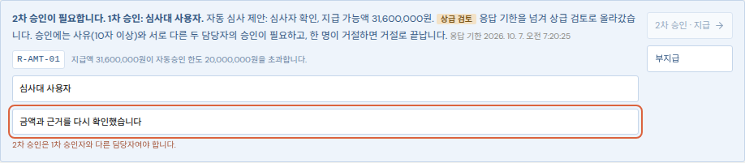

# 보험금 청구 자동 심사 — FitWitness 런타임 위의 두 번째 워크플로

고객이 보험금을 청구하면 서류(진단서·입퇴원확인서·수술확인서·영수증)에서 필요한 값만 뽑고, 사내 지급 기준을 적용해 지급·부지급·담당자 확인으로 나누며, 지급은 한 번만 기록해야 합니다. 이 워크플로는 도면 검증과 **같은 런타임**(leased job, checkpoint, `waiting_input`·resume, 재시도·보류함, 지표·trace)을 쓰고 일만 다릅니다. 서류·계약·인물은 전부 합성이며 실제 개인정보는 없습니다.

```
intake ─▶ extract ─▶ validate ─▶ adjudicate ─▶ challenge ─┬─▶ payout ─▶ END
   서류 확인    필드+위치     서류 간 정합성   기준표 적용     반례 검토   │  멱등 원장
                                                            └─▶ review(interrupt) ─▶ payout
```

## 에이전트 조합과 의사결정 포인트

| 노드 | 하는 일 | 사람 개입 조건 |
|---|---|---|
| extract | 서류별로 라벨을 키로 값과 **위치(bbox)**를 읽습니다. 날짜 4가지 표기와 금액 표기를 정규화하고, 해석되지 않는 값은 추측하지 않고 원문 그대로 남깁니다. 모델 경로에서는 모델이 값과 인용 스니펫을 제안하고, 스니펫이 실제 서류에 있을 때만 채택합니다(`ground`) | 신뢰도 < 0.7이면 심사자에게 |
| validate | 퇴원일 < 입원일, 수술일이 입원기간 밖, 진단코드 형식 오류, 근거 위치 없는 값 등 서류 간 모순을 플래그로 남깁니다 | 플래그가 있으면 심사자에게 |
| adjudicate | 상품별 기준표(`claims/policy.py`)를 적용합니다. 입원일당(면책일 차감·한도), 수술비(1~5종 정액), 진단비(코드 접두어별 정액, 90일 면책기간), 면책 질병, 계약 상태·보험기간, 중복 청구(원장 키), 자동승인 한도. 모든 금액과 거절·보류에 규칙 ID가 붙습니다 | 서류 누락, 한도 초과, 부분 거절 + 지급 항목 공존 |
| challenge | 지급 항목이 기대는 필드에 **근거 위치가 없으면** 지급을 막고 심사자에게 보냅니다. 청구인이 "항상 담당자 확인"을 요청한 경우도 여기서 멈춥니다 | 근거 없는 지급 항목 |
| review | LangGraph `interrupt()`로 `waiting_input`에 멈춥니다. 답변은 `ClaimReview{outcome: APPROVE/DENY, reviewer, note, total_amount?}`이며 `POST /api/runs/{id}/resume`으로 들어옵니다. 담당자 결정은 규칙 `R-HUMAN-01`로 기록됩니다 | — |
| payout | `fw_payouts`(청구당 1행)와 `fw_payout_keys`(사건 키)에 **한 번만** 기록합니다. 기록 직후 worker가 죽어도(체험 토글) 재시도는 같은 노드에서 이어지고 `already_paid`를 받습니다. 돈이 두 번 움직이지 않습니다 | — |

## 지급 기준표(가상)

| 상품 | 입원일당 | 수술비 | 진단비 | 자동승인 한도 |
|---|---|---|---|---|
| 종합건강보험 A형 (HLTH-A) | 30,000원/일, 3일 면책, 120일 한도 | 1종 10만 · 2종 30만 · 3종 50만 · 4종 100만 · 5종 200만, Q·Z41 면책 | C* 1,000만 · D0* 200만 · I21* 500만 · I6* 500만, 90일 면책기간, C44 면책 | 500만원 |
| 암진단 플러스 B형 (CANCER-B) | 50,000원/일, 면책 없음, 180일 | — | C* 3,000만 · D0* 600만, 90일 면책기간, C44 면책 | 2,000만원 |

실제 약관을 옮긴 것이 아니라 규칙 엔진이 다루는 종류를 보여주는 가상 값입니다.

## 합성 데이터

`python -m fitwitness.claims.synth var/claims 120` 은 11개 시나리오(정상, 스캔 품질 저하, 표기 형식 다양, 서류 누락, 날짜 불일치, 면책기간, 면책 질병, 중복 청구, 실효 계약, 한도 초과, 수술 등급 누락)로 120건을 만듭니다. 각 건은 A4 PDF 2~4장과 미리보기 PNG, 그리고 평가기만 읽는 `gold.json`(진실값, 규칙 엔진을 진실값에 적용한 정답 결정, 서류에 실제로 인쇄된 필드 목록)으로 구성됩니다. 한글은 Noto Sans KR(OFL) 글리프 부분집합을 임베드해 렌더링하며, 생성기는 그 부분집합 밖의 글자를 쓰면 실패합니다.

## 측정 (API 없이, 120건)

| 지표 | 값 | 뜻 |
|---|---|---|
| 필드 정확도 | 97.7% | 서류에 인쇄된 필드를 정확히 읽은 비율 |
| 결정 정확도 | 92.5% | 결과와 금액이 정답과 같은 비율 |
| **잘못 지급** | **0건 (0.0%)** | 정답이 지급이 아닌데 지급했거나 금액이 다른 경우 |
| 자동 처리율 | 88.5% | 정답이 지급인 건 중 사람 없이 끝난 비율 |
| 심사자 확인 비율 | 약 55% | 시나리오 설계상 절반 이상이 의도적으로 사람에게 감 |
| 열화 대조군 잘못 지급 | 15.8% | 서류 요건·원장 조회·자동승인 한도를 끈 실행. 벤치마크가 열화를 감지함 |

정확도가 100%가 아닌 이유는 스캔 품질 저하 시나리오에서 날짜가 해석되지 않아 심사자에게 보내기 때문입니다. 이것은 의도된 보수적 동작이며 잘못 지급으로 이어지지 않습니다. 이 지표들은 `python -m fitwitness.evaluation.gate`의 `claims` 스위트로 매 커밋 베이스라인과 비교됩니다(`docs/evaluation/gate-baseline.json`).

## 스캔 문서 읽기 (OCR)

사진이나 팩스로 들어온 서류는 텍스트 층이 없는 PDF입니다. 위의 120건은 텍스트 층이 있어서 글자를 그대로 읽는데, 그것만으로는 "읽기가 틀렸을 때 시스템이 어떻게 행동하는가"를 알 수 없습니다. 그래서 같은 서류를 스캔처럼 망가뜨려 Tesseract(kor+eng)로 읽는 경로를 만들고 측정했습니다.

```bash
# apt install tesseract-ocr tesseract-ocr-kor 가 필요합니다. 없으면 스캔 페이지는 "읽은 것이 없음"이 되어 담당자에게 갑니다.
uv run python -m fitwitness.claims.evaluate --scan medium --split test --workers 4
```

**스캔 만들기** (`claims/scan.py`). 페이지를 이미지로 그린 뒤 기울기·번짐·잡음·대비·JPEG 압축을 네 단계(`clean`/`light`/`medium`/`heavy`)로 가하고, 이미지만 든 PDF로 다시 묶습니다. 값은 서류와 건 번호에서 정해져 재현됩니다.

**읽기** (`claims/ocr.py`). Tesseract는 한글을 음절 하나씩 돌려줍니다. 같은 줄에서 간격이 글자 높이의 0.6배보다 작은 조각을 한 단어로 묶고, 콜론으로 끝나는 단어가 양식의 알려진 라벨이면 그 오른쪽을 값으로 봅니다. 값의 길이는 필드 종류가 정합니다(날짜 1단어, 금액 2단어). 읽은 위치는 텍스트 층일 때와 같은 쪽 기준 좌표의 근거 상자로 남고, 거기에 **글자별 신뢰도**가 추가됩니다. 값의 신뢰도는 그 값을 이룬 조각 중 가장 낮은 것입니다.

**자리가 말해 주는 만큼만 고칩니다.** 날짜의 `O`는 `0`, 금액의 `l`은 `1`, 진단코드 꼬리의 `S`는 `5`입니다. 코드의 첫 글자가 숫자로 읽히면 `1→I`, `2→Z`처럼 하나로 정해지는 것만 고칩니다. `0`은 O일 수도 D일 수도 Q일 수도 있어 고치지 않습니다. 이것은 측정에서 나온 규칙입니다. 처음에는 `0→O`로 고쳤고, 유방 상피내암종의 `D05.1`이 `O05.1`로 읽혀 "지급 대상이 아닌 코드"로 부지급 처리되는 건이 나왔습니다.

**합계는 영수증이 스스로 검산합니다.** 영수증의 `급여본인부담금 + 비급여 = 합계`가 맞으면 합계가 확정됩니다. 금액 뒤의 `원`이 `2!`나 `H`로 읽히는 일이 잦았고(`2,909,1912!`), 숫자 부분만 보면 한 자리가 더 붙은 금액이 됩니다. 검산이 맞으면 단위 쪽 잡음은 무시하고, 안 맞으면 금액을 비워 담당자에게 보냅니다. 두 줄을 읽지 못했을 때는 금액 형식(천 단위 쉼표를 지키고 끝에 단위)을 지킨 값만 받습니다. 검산이 맞은 합계는 `원` 글자의 낮은 신뢰도 때문에 담당자에게 가지 않습니다.

**신뢰도 바닥은 지급에 쓰는 값에만 겁니다.** R-CONF-01(0.7)은 진단코드·세 가지 날짜·수술 등급·합계 중 가장 낮은 신뢰도를 봅니다. 병원 이름이나 수술명은 `한빛→한빚`처럼 자주 틀리지만 이것으로 돈이 나가지 않으므로 심사자에게 보이기만 합니다. 이 구분이 없을 때는 맞게 읽은 건도 병원 이름 한 글자 때문에 대부분 담당자에게 갔습니다(clean/dev의 자동 처리율 58% → 이 구분만으로 71%, 합계 검산을 더하면 88%).

**스캔에 근거한 부지급은 자동으로 확정하지 않습니다** (R-SCAN-01). 첫 측정에서 지급이 틀린 건은 0이었지만, 부지급은 480건 중 10건이 정답과 달랐습니다. 4건은 코드 오독으로 지급 대상 청구가 부지급이 된 것입니다. 그래서 값에서 비롯된 부지급은 스캔일 때 담당자 확인으로 보냅니다. 계약 상태(실효)처럼 스캔과 무관한 부지급은 그대로 부지급입니다.

### 측정

합성 120건을 건 번호 짝/홀로 나눠, 짝수(dev)로 규칙과 상수를 정하고 홀수(test)에서 확인했습니다. 각 칸은 60건입니다. 이 숫자들은 위 규칙을 고정한 뒤 처음부터 다시 잰 값입니다. 다만 test에서 틀린 건 하나(CLM-00051, 코드 오독으로 인한 잘못 부지급)를 열어 보고 규칙을 바꿨기 때문에, test는 완전한 홀드아웃이 아닙니다.

| 열화 | 분할 | 필드 정확도 | 자동 처리율 | 담당자 확인 | 잘못 지급 | 잘못 부지급 | 건당 p50 |
|---|---|---|---|---|---|---|---|
| clean | dev | 95.8% | 87.5% | 55.0% | **0** | **0** | 2.3초 |
| clean | test | 93.6% | 78.6% | 58.3% | **0** | **0** | 2.3초 |
| light | dev | 94.2% | 87.5% | 55.0% | **0** | **0** | 5.7초 |
| light | test | 94.0% | 78.6% | 58.3% | **0** | **0** | 5.8초 |
| medium | dev | 94.4% | 91.7% | 53.3% | **0** | **0** | 8.8초 |
| medium | test | 94.4% | 78.6% | 58.3% | **0** | **0** | 8.9초 |
| heavy | dev | 90.6% | 70.8% | 61.7% | **0** | **0** | 4.4초 |
| heavy | test | 92.9% | 67.9% | 63.3% | **0** | **0** | 4.5초 |

(참고: 텍스트 층 120건은 필드 97.7%, 자동 처리율 88.5%, 담당자 확인 약 40%.) 480건을 읽어 잘못 지급과 잘못 부지급이 모두 0건입니다. 읽기가 틀린 곳은 잘못 지급이 아니라 담당자 확인으로 나타납니다. 대가는 자동 처리율입니다. 텍스트 층 88.5%가 test 기준 clean에서 78.6%, heavy에서 67.9%로 내려갑니다. 부지급 정답 건은 전부 담당자에게 가므로 "결정 정확도"는 65~80%로 낮아지는데, 이것은 의도한 동작입니다(스캔은 지급하거나 넘길 뿐 돌려보내지 않음).

필드별로는 날짜 대부분이 97~100%이고 합계는 test 기준 clean 93%, medium 95%, heavy 82%입니다. **가장 약한 곳은 진단코드(test 75~88%)**입니다. 첫 글자가 `D`/`O`/`Q`/`0`으로 뒤섞이고 `Z41.1`이 `241.1`로 읽히는 식입니다. 틀린 코드는 모양 검사에서 걸리거나 신뢰도가 낮아 담당자 확인으로 갔고, 틀린 채 지급된 건은 없었습니다. 그러나 이것이 구조적으로 막혀 있는 것은 아니고, 이 표본에서 일어나지 않았다는 뜻입니다.

게이트에는 시나리오당 2건(22건, medium)의 표본이 선택 스위트 `claims_scan`으로 들어 있습니다. Tesseract가 있으면 매 커밋 잘못 지급·잘못 부지급 0과 필드 정확도·자동 처리율 하한을 확인하고, 없으면 건너뜁니다.

### 공식 서식 읽기

실제 서식은 `라벨: 값` 줄이 아니라 표입니다. 의료법 시행규칙 별지 제5호의2 진단서와 국민건강보험 요양급여의 기준에 관한 규칙 별지 제6호 진료비 계산서·영수증은 라벨에 콜론이 없고, 값이 라벨 오른쪽 칸이나 아래 칸에 들어가며, 서식이 칸 안에 `년 월 일부터` 같은 안내 문구를 미리 찍어 둡니다. 앞의 읽기에 이 서식을 넣었을 때 값으로 읽힌 것은 그 안내 문구뿐이었습니다(아래 "범위와 한계" 참고).

`claims/official.py`가 이 두 서식을 칸 구조로 읽습니다. 페이지에 인쇄된 라벨로 서식을 알아보고(진단서는 환자의 성명·질병분류기호·진단 연월일, 계산서는 진료비 총액·환자 성명·질병군(DRG)번호가 모두 있을 때), 라벨 칸의 위치를 PDF의 선에서 구해 값이 있을 칸(오른쪽 칸, 같은 칸의 아래, 라벨 뒤)을 정합니다. 서식이 찍어 둔 안내 문구는 값으로 읽지 않습니다. 결과는 앞과 같은 `(라벨, 값, 근거 위치)`라서 정합성 검사부터 지급까지는 그대로입니다. 두 서식이 아닌 페이지는 `라벨: 값` 읽기로 갑니다.

읽는 칸은 진단서의 환자 성명·병명(주 질병)·질병분류기호·진단 연월일·입원일·퇴원일·의료기관 명칭, 계산서의 환자 성명·진료비 총액(⑦)·상호입니다. 그 밖의 칸(발병 연월일, 부 질병, 전화번호, 환자등록번호, 진료과목 등)은 읽지 않습니다.

**측정 방법.** 국가법령정보센터의 공식 빈 서식 두 가지를 받아(저장소에는 넣지 않았습니다) 합성 120건의 값을 칸에 채워 넣었습니다(`claims/official_fill.py`). 값은 칸 안에서 위치를 0~6pt 흔들고 글자 크기를 바꿔 넣었고, 옆 칸에는 읽으면 안 되는 값을 채웠습니다. 값을 넣는 좌표는 서식에서 잰 것이고 읽기에는 알려 주지 않습니다. 읽기는 파이프라인과 같은 `extract_documents`로 하고, 필드마다 맞음·비어 있음·다른 값으로 나눕니다. `scripts/eval-official-forms.py`가 이 측정을 하며, 받아 둔 서식을 `--diagnosis-form`, `--receipt-form`으로 주면 실제 서식에서, 주지 않으면 서식의 라벨과 선을 다시 그린 판(`claims/official_layouts.json`, CI가 쓰는 것)에서 잽니다.

| 위치 흔들림 | 실제 빈 서식에 채움 | 다시 그린 판에 채움 |
|---|---|---|
| 0pt | 1200/1200 | 1200/1200 |
| ±1.5pt | 1200/1200 | 1200/1200 |
| ±3pt | 1200/1200 | 1200/1200 |
| ±4.5pt | 1200/1200 | 1200/1200 |
| ±6pt | 1200/1200 | 1200/1200 |

각 칸은 진단서 7개와 계산서 3개 필드를 120건에 채운 1200번의 읽기이고, 필드별 집계는 `docs/evaluation/official-forms-real.json`, `official-forms-redrawn.json`에 있습니다. 틀린 값은 한 번도 나오지 않았고 비어 있는 경우도 없었습니다. 값을 하나도 쓰지 않은 빈 서식은 아무것도 읽지 않습니다(앞의 읽기는 안내 문구를 날짜로 읽었습니다). 파이프라인으로는 120건에서 필드 정확도 98.6%, 잘못 지급 0건, 잘못 부지급 0건이고 자동 처리율은 텍스트 층 120건과 같은 88.5%입니다. 나머지 1.4%는 이 측정에서 건드리지 않은 입퇴원확인서·수술확인서에 일부러 넣은 노이즈입니다. 같은 서류를 서식 읽기 없이 `라벨: 값` 읽기로만 읽으면 필드 정확도가 64.9%이고 진단일과 합계는 0%입니다. 게이트의 `claims_official`이 이 차이를 대조군으로 쓰며, 격차가 0.05 아래로 줄면 실패합니다.

측정하면서 읽기가 틀린 곳이 세 군데 나왔고 모두 고쳤습니다. 라벨 바로 옆에 붙여 쓴 값(`명칭:병원`)이 PDF에서 라벨과 한 단어로 나와 값이 사라졌고, 값이 서식의 줄보다 3pt 이상 높거나 낮으면 다른 줄로 갈려 날짜의 년·월·일 순서가 뒤섞여(`2026-10-06`) 틀린 날짜가 나왔고, 서식이 `년 월 일` 사이에 찍어 둔 공백 위에 값을 쓰면 숫자가 한 글자씩 갈렸습니다. 첫째·둘째 항목은 이 측정의 위치 흔들림이 있어야 드러났습니다. 이것과 별개로 정책의 틈도 하나 나왔습니다. 진단서는 깨끗하게 읽혔는데 다른 서류의 날짜가 깨져 신뢰도가 0.7 아래인 건이, 깨끗이 읽은 진단코드가 보장 대상이 아니라는 이유로 부지급이 되었습니다(정답은 담당자 확인). 신뢰도가 바닥 아래인 상태의 부지급은 이제 담당자에게 갑니다(R-DOUBT-01). 서류끼리 날짜가 어긋나는 것만으로는 부지급이 보류되지 않습니다. 부지급이 어긋나지 않은 필드에서 나올 수 있기 때문입니다.

## API

| 메서드 | 경로 | 설명 |
|---|---|---|
| GET | `/api/claims/cases` | 작업 공간의 합성 청구 건과 최근 실행 |
| POST | `/api/claims/cases/{case_id}/run` | 자동 심사 실행. 헤더 `x-claim-review: always`는 항상 담당자 확인, `x-demo-fault: 1`은 지급 기록 직후 중단 체험 |
| GET | `/api/claims/cases/{case_id}/documents/{doc_id}/{png\|pdf}` | 서류 원문 |
| GET | `/api/claims/ledger` | 지급 원장 |
| POST | `/api/runs/{id}/resume` | `ClaimReview` 답변으로 재개 (도면 실행은 `ReviewInput`) |

실행 결과는 `GET /api/runs/{id}`의 `claim` 필드에 `ClaimOutcome`(추출·플래그·결정·심사 전 결정·담당자 답변·지급 영수증·안내문·감사 로그)으로 담깁니다.

## 범위와 한계

- 서류는 합성본입니다. 텍스트 층이 있는 PDF와, 그것을 이미지로 그려 열화시킨 **시뮬레이션 스캔**을 읽었습니다. 실제 스캐너·카메라 사진, 손글씨, 병원별 양식 차이, 도장·서명이 값 위에 겹치는 경우는 다루지 않습니다. 합성 서류는 생성기가 쓰는 글꼴·배치 한 가지라서, 위 OCR 수치는 실제 문서의 성능이 아니라 이 경로가 틀렸을 때 어떻게 행동하는지에 대한 증거입니다.
- 공개 데모 이미지에는 Tesseract가 없고 업로드 경로도 없어 스캔 읽기는 로컬·CI에서만 돕니다.
- **공식 서식 읽기는 두 서식에 대해, 제가 값을 채워 넣은 것에서만 측정했습니다.** 위 표는 서식의 칸에 생성기의 값을 제가 넣은 결과입니다. 병원 소프트웨어가 실제로 값을 찍는 위치와 방식(글꼴, 정렬, 칸을 넘는 긴 값, 도장과 서명이 값 위에 겹치는 경우, 손글씨)은 반영하지 않았습니다. 진단서 별지 제5호의2와 계산서 별지 제6호 한 가지씩이며, 간이 외래 계산서(별지 제12호)는 알아보지 못하고 읽지 않습니다(항목이 없는 것으로 처리되어 담당자에게 갑니다). 입퇴원확인서·수술확인서·보험금 청구서·진료확인서의 공식 양식은 읽지 않습니다. 스캔한 공식 서식은 이 경로가 아니라 OCR 경로를 타므로 칸 구조로 읽히지 않습니다. 이 서식들은 저장소에 넣지 않았고, 저장소에 있는 것은 라벨과 선을 다시 그린 좌표(`official_layouts.json`)입니다.
- 지급 기준은 가상이며 법적·약관적 해석이 아닙니다.
- 모델 추출 경로(`provider != rules`)는 구현되어 있으나 유료 실측은 하지 않았습니다. 규칙 추출기와 동일한 근거 검사(`ground`)를 거칩니다.
- 외부 지급 시스템과의 exactly-once는 원장 기록까지만 보장합니다.

## 공개 데모

<https://fitwitness.onrender.com/#claims> 에서 바로 열립니다(같은 사이트의 "청구 심사" 탭). 체험 공간마다 시나리오별 합성 청구 8건이 들어 있고, 모든 서류·계약·인명은 생성된 데이터입니다.

- **정상 청구**: 자동 심사 시작 → 서류에서 입원일·퇴원일 등을 위치와 함께 추출 → 적용 조항(R-HOSP-01 등)과 금액 → 지급 원장에 1건 기록.
- **자동승인 한도 초과**: 지급 가능액이 한도를 넘으면 담당자 확인 대기로 멈추고, 승인·부지급을 고르면 그 결정과 메모가 결과에 남습니다.
- **서류 누락 / 날짜 불일치 / 면책기간 / 중복 청구**: 각각 규칙 ID와 함께 담당자 확인 또는 부지급으로 나뉘며, 중복 청구는 원장에 기록되지 않습니다.
- **지급 기록 직후 중단 체험**: 체크하고 시작하면 지급 기록 직후 worker가 중단되고, 재시도가 저장된 지점부터 이어집니다. 원장에는 같은 청구가 한 번만 남습니다.

2026-10-07 공개 서버 실측(브라우저 자동화, 무료 인스턴스): 정상 청구 심사 완료 2.4초, 한도 초과 건 담당자 확인 대기 진입 2.3초, 승인 후 지급 완료 1.4초, 중복 청구 부지급 1.4초, 중단 체험은 중단 후 복구 완료까지 13.5초(새 worker 기동 포함)였고 원장 금액은 중단 전후 그대로였습니다.

## 승인 권한과 응답 기한

담당자 확인으로 멈춘 청구에 누가 서명하는지는 상품 기준표에 데이터로 있습니다(가상의 전결 규정입니다). `claims/review.py`가 규칙을, `claims/graph.py`의 `review` 노드가 지급을 실제로 막습니다.

| 구간 | 규칙 |
|---|---|
| 자동승인 한도 이하 | 사람 없이 지급 |
| 한도 초과 ~ `second_approval_above` 이하 (HLTH-A 500만~1,000만원, CANCER-B 2,000만~3,000만원) | 담당자 1명이 승인하거나 거절 |
| `second_approval_above` 초과 (**상급 검토**) | 승인에는 **사유(10자 이상)**와 **서로 다른 두 담당자**의 승인이 필요. 한 명이 거절하면 거절로 끝나며, 2차 질문은 거절에는 나오지 않음 |
| 응답 기한(`FITWITNESS_REVIEW_TTL_SECONDS`, 기본 24시간)을 넘김 | 금액과 상관없이 **상급 검토로 올라감**. 대신 지급하거나 거절하지 않음 |

- 첫 번째 승인만으로는 원장이 움직이지 않습니다. 그래프는 같은 노드에서 `interrupt()`를 두 번 부르고, 2차 질문에 1차 승인자의 이름과 사유가 담깁니다. 두 번째 답이 같은 사람이면 `resume`이 422로 되돌려 보내고(답은 저장되지 않고 실행은 계속 대기), 그래프도 이를 믿지 않고 다시 확인합니다.
- 금액 조정은 1차 담당자만 할 수 있고 2차 담당자는 조정된 금액을 확인합니다.
- 응답 기한은 질문마다 새로 시작합니다. 만료 점검은 dispatcher가 30초마다 돌며, 한 실행은 한 번만 올라갑니다(`review_escalated` 이벤트). 담당자 답이 도착하면 기한 기록이 지워집니다.
- 이벤트에는 `human_review`에 서명한 사람들(`approvers`)과 등급(`tier`)이 남고, 청구 결과(`ClaimOutcome.approvers`)와 화면의 "사람 개입"에도 두 이름이 나옵니다.



**한계.** 공개 데모에는 계정이 없어 담당자 이름은 입력한 문자열입니다. "서로 다른 두 사람"은 이름이 다르다는 뜻이며, 인증된 신원에 묶는 것은 배포 환경의 몫입니다. 역할(`viewer`/`operator`/`admin`) 기반 권한 분리와 위험 등급별 다단계 승인표는 없습니다. 공개 데모의 기본 기한은 24시간이라 데모 세션(1시간) 안에서 에스컬레이션이 보이지는 않습니다. 화면과 동작은 기한을 4초로 낮춘 로컬 서버에서 확인했습니다.

