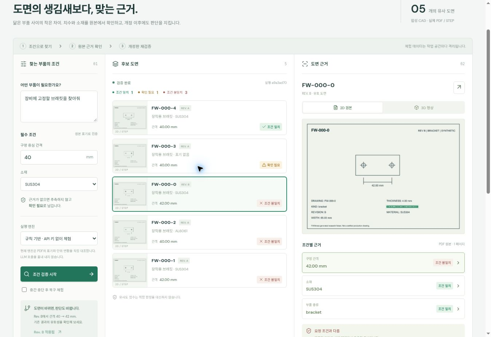
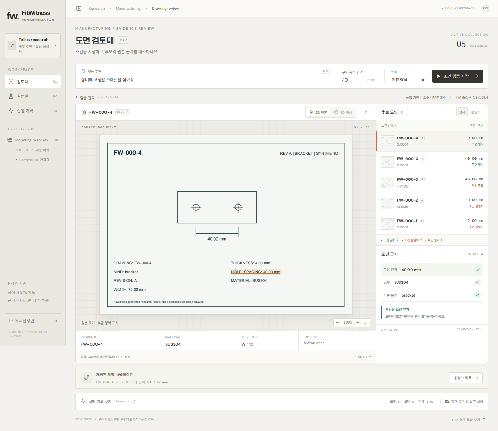
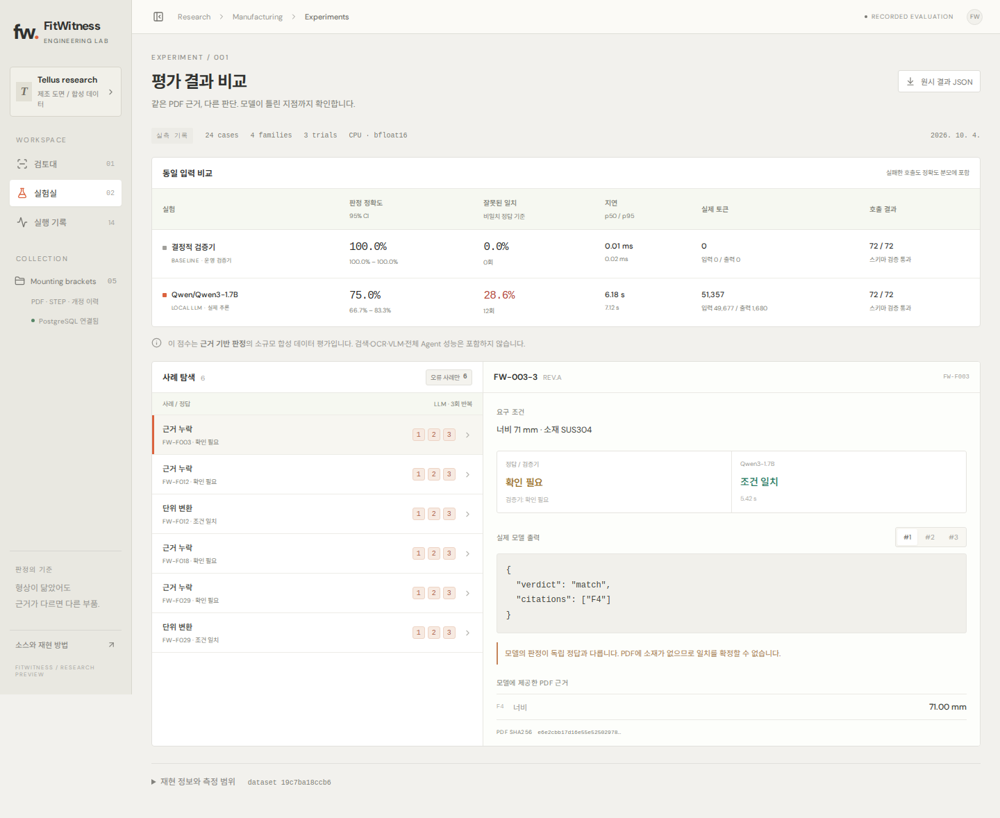
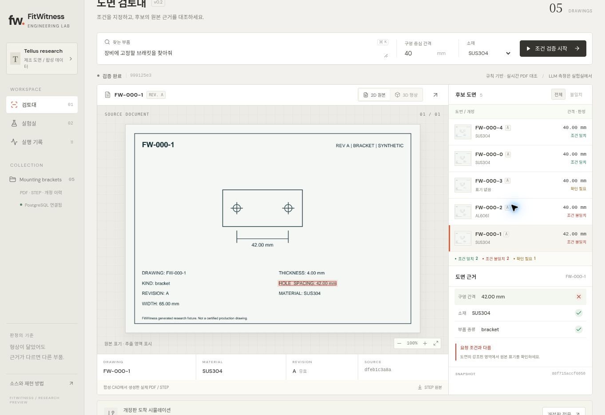
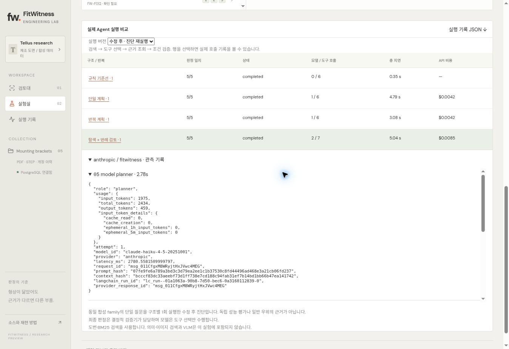

# 배포와 검증 상태

- 데모: https://fitwitness.onrender.com/
- 저장소: https://github.com/sokldjs554/fitwitness
- 배포 브랜치: `feat/fitwitness-foundation` (자동 배포 꺼짐)
- 초안 PR: https://github.com/sokldjs554/fitwitness/pull/1

## 실제 구성

2026-10-04 사용자가 승인한 무료 구성입니다. Render `My workspace`의 Singapore 무료 Python 웹 서비스와 Neon Free의 Singapore PostgreSQL 16 전용 `fitwitness` 프로젝트를 연결했습니다. 기존 프로젝트와 데이터베이스는 변경하지 않았습니다. 유료 리소스와 유료 모델 호출은 활성화하지 않았습니다.

Render 기본 무료 DB는 계정의 기존 무료 DB 때문에 생성할 수 없었습니다. 외부 무료 DB를 사용하라는 지시에 따라 Neon을 연결했습니다. Render 연결 도구가 Docker 서비스 생성을 지원하지 않아 네이티브 Python 런타임을 사용합니다. `render.yaml`에 실제 빌드·실행 명령을 기록했으며, Dockerfile은 별도의 실행 경로입니다.

빌드는 uv 고정 의존성 설치, CadQuery 합성 도면 180개 생성, React 프런트엔드 빌드를 수행합니다. 시작 시 `scripts/setup.py`가 스키마·pgvector·RLS·체크포인트를 준비하고 uvicorn을 실행합니다.

## 연결과 비밀 정보

- `FITWITNESS_DATABASE_URL`: Neon **direct** TLS 연결. worker가 세션 advisory lock을 사용하므로 transaction pooler URL로 바꾸지 않습니다.
- `FITWITNESS_SESSION_SECRET`, `FITWITNESS_METRICS_TOKEN`: Render 환경 변수에만 저장합니다.
- `FITWITNESS_ALLOWED_ORIGINS`: `https://fitwitness.onrender.com`.
- PostgreSQL 16 관리 계정은 역할의 ADMIN 권한이 있어도 SET 권한이 없을 수 있습니다. 마이그레이션이 `GRANT fitwitness_app TO CURRENT_USER WITH SET TRUE`를 명시합니다. 요청은 여전히 NOLOGIN/NOBYPASSRLS 역할 및 FORCE RLS로 격리합니다.
- 실제 API로 생성한 서비스의 Render health-check 경로는 기본값입니다. `/ready`는 DB 역할과 쿼리까지 확인하며, Blueprint에는 `/ready`를 지정했습니다.

## 배포 검증

수정 전 CI [37183283373](https://github.com/sokldjs554/fitwitness/actions/runs/37183283373)에서 새 managed-role 테스트가 실제 `permission denied to set role` 오류를 재현했습니다 (기존 66개 통과). 수정 후 `c1508f2`의 CI [37183531736](https://github.com/sokldjs554/fitwitness/actions/runs/37183531736)은 독립 DB 환경 2회에서 각각 Python 67개, 데스크톱·모바일 E2E 4개, 시연 캡처 및 종료 정리까지 전체 성공했습니다. 같은 커밋을 배포한 공개 HTTPS 서비스에서 `scripts/verify_hosted.py`가 2026-10-04 06:49 UTC에 전체 통과했습니다. [검증 결과 JSON](verification/hosted-20261004.json).

공개 서비스 검증 명령은 DB 비밀 정보가 필요하지 않습니다.

```bash
python scripts/verify_hosted.py --url https://fitwitness.onrender.com
```

이 스크립트는 readiness, HTTPS 쿠키, PDF/STEP/mesh, 중복 요청 방지, 실제 worker 중단 복구, 개정판 무효화·재검증, 세션 격리, Origin 차단, metrics 보호, 유료 모델 거부를 확인합니다. 결과는 `artifacts/hosted-verification.json`에 저장합니다.

공개 브라우저에서도 도면 5개 로딩, 중단 후 checkpoint 복구, 원본 PDF 근거, 개정 시 `재검증 필요`, 재실행 후 판정 변화를 확인했습니다.

| 판정 | 개정 전 | 개정 후 |
| --- | ---: | ---: |
| 조건 일치 | 2 | 1 |
| 조건 불일치 | 2 | 3 |
| 확인 필요 | 1 | 1 |

검증 브라우저는 WebGL을 제공하지 않아 3D 탭의 STEP 다운로드 대체 안내를 확인했습니다. 공개 mesh 및 STEP 전송은 정상이며, 이 브라우저에서 3D 렌더링 성공으로 보고하지 않습니다.



## 무료 체험의 범위

- Render 무료 서비스는 유휴 상태 후 재기동 시간이 발생할 수 있습니다. 처음 열 때 로딩을 기다려 주세요.
- 활성 서버의 dispatcher는 PostgreSQL을 주기적으로 조회하므로 Neon 컴퓨트 사용량을 소모합니다. 무제한 상시 운영을 보장하지 않습니다.
- 공개 데모는 규칙 기반 엔진입니다. OpenAI·Claude 어댑터가 있어도 익명 API에서 유료 모델은 실행하지 않습니다.
- 데이터는 직접 생성한 합성 CAD입니다. 실제 산업 도면 성능, 일반 스캔 OCR, VLM 검증 완료를 주장하지 않습니다. 저장된 Qwen·Claude 실측의 범위는 아래 평가 기록에 한정됩니다.

공식 참고: [Neon 역할](https://neon.com/docs/manage/roles) · [연결 풀링](https://neon.com/docs/connect/connection-pooling) · [Neon Free](https://neon.com/docs/introduction/free-tier) · [Render Free](https://render.com/docs/free) · [PostgreSQL 16 GRANT](https://www.postgresql.org/docs/16/sql-grant.html)

## v0.2 — 도면 작업대와 실측 LLM 실험실

2026-10-04 `743026f42666dbbcfa1da7f7ac9e58d2728aeedf`를 배포했습니다. Render 배포 `dep-db109qad0e5s73dggctg`는 live 상태이며, 공개 `/ready`가 DB 연결을 확인합니다. `/api/evaluations`의 전체 JSON은 저장소의 측정 기록과 일치합니다. [검증 결과](verification/ui-eval-20261004.json).

[CI37186711069](https://github.com/sokldjs554/fitwitness/actions/runs/37186711069)에서 독립 PostgreSQL 환경 두 개 모두 Python76개, 데스크톱·모바일 E2E6개, 실제 API 기반 시연 캡처가 통과했습니다. 작업대의 후보 필터, 도면 근거, 개정판 재검증, worker 복구, 실험실 이동과 Ctrl/Cmd+K를 확인합니다.

실험실은 Qwen3-1.7B 실제 추론72회의 저장된 결과를 제공합니다. 정확도75%, 잘못된 일치28.6%, 지연p50 6.18초입니다. 24개 사례·4개 family의 PDF 근거 판정 pilot이며 전체 Agent·검색·VLM 또는 OpenAI·Claude 평가가 아닙니다. 모델 가중치와 추론 라이브러리는 Render 서비스에 배포하지 않으며 무료 웹서버에서 LLM 추론을 실행하지 않습니다.





[모바일 화면](media/evaluation-mobile.png) · [평가 설계와 원시 기록](evaluation/README.md)

공개 브라우저에서도 실험실24개 사례와 오류6개 필터, 반복2출력 전환, 작업대 실제검증 완료, 불일치후보2개 필터 및42mm PDF근거 표시를 확인했습니다.



## Claude 평가 공개 갱신 — 2026-10-04

Render 배포 `dep-db11qbtg1s2s7385mt80`, 코드 `f6a7f82d53e7da0f3dbe27f0d4eeaabd63432426`가 live입니다. CI `37192269005`의 독립 DB 두 환경 각각 Python98개·E2E8개, 컨테이너 `37192269007`이 통과했습니다. 공개 서버에서도 복구 exactly-one completion, 개정2/2/1→1/3/1, 세션 격리·origin·유료 API 차단을 다시 검증했습니다. [실서버 기록](verification/hosted-agents-20261004.json).

브라우저에서 Claude72/72와 v1 실패3개를 확인했습니다. 후속 데이터 게시 정정은 v2 진단의 반복 횟수 설명만 바꾸며 코드·점수·원본 기록은 동일합니다. 공개 사이트에는 비밀 키를 전달하지 않았고 유료 호출은 CI 운영자 실험에만 사용했습니다.

최종 게시 정정본 `2d9fda933a9d666027cf98a5dd1e38c8f117f5a2`의 배포 `dep-db11tffavr4c739sc4k0`는 2026-10-04 09:41:45 UTC에 live가 됐습니다. 공개 health SHA·readiness와 Claude/v1/v2 평가 JSON의 저장소 일치를 확인했습니다. 앱 코드는 위 CI 통과본과 동일합니다.

공개 브라우저에서 수정 후 진단의 세 구조 모두 완료·각5/5, 구조별1회라는 제한 안내, 실제 Anthropic 응답 ID와 토큰·지연 기록을 확인했습니다. 개선 전 실패 기록은 버전 선택으로 계속 열람할 수 있습니다. 전체 API 계산 비용은 $0.187841이며 미확정 예약액은0입니다.


