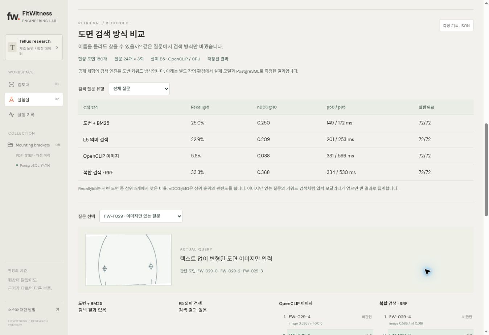
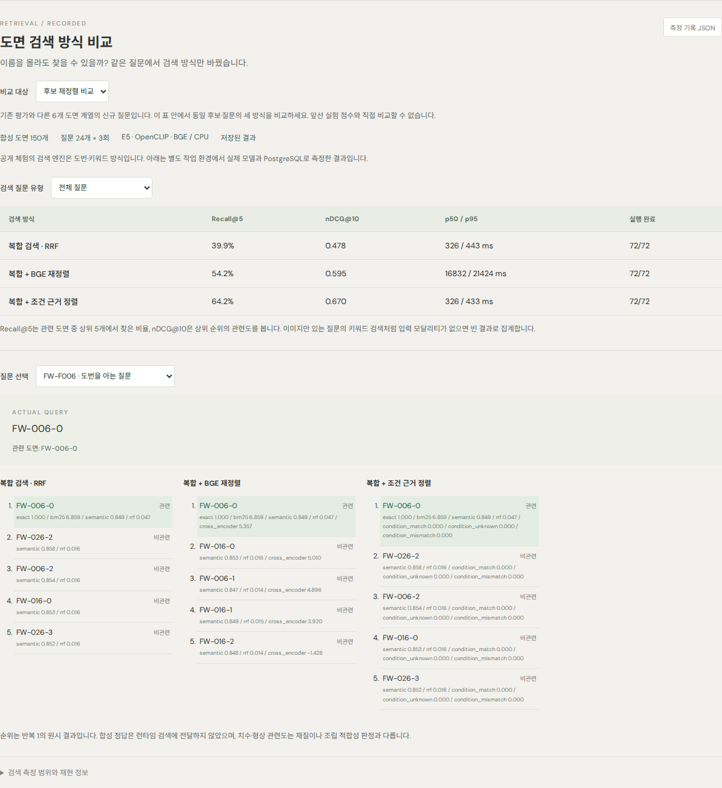
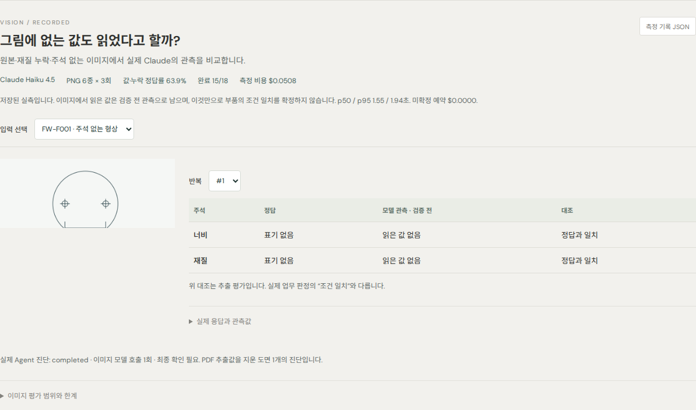

# 실측 기록과 제출 당시 검증 — 원문 보존

이 문서는 README 첫 화면에 있던 실측·검증 서술을 **원문 그대로** 옮긴 것입니다. 숫자·링크·날짜는 당시 기록이며, 이후 브랜치에서 코드가 바뀌어도 이 문서는 수정하지 않습니다. 최신 코드의 자동 측정은 [평가 게이트](EVALUATION-GATE.md)가, 새 실행 흐름은 [워크플로 문서](WORKFLOW.md)가 설명합니다. 링크 경로만 이 문서 위치(`docs/`)에 맞게 바꿨습니다.

## 제출 코드 검증

실제 Claude 실측과 실패→수정 기록을 포함합니다. [PDF 72회](https://github.com/sokldjs554/fitwitness/actions/runs/37191423446) · [Agent 최초 실패 포함](https://github.com/sokldjs554/fitwitness/actions/runs/37191644166) · [수정 후 재실행](https://github.com/sokldjs554/fitwitness/actions/runs/37191981503) · [최종 코드 Claude gate](https://github.com/sokldjs554/fitwitness/actions/runs/37321337436).

최종 제출 코드 `fbf3dbae` 검증: 독립 PostgreSQL 두 환경 각각 Python **145개**와 Playwright **58개**를 통과했고, 실제 API 데모 캡처와 Docker package도 성공했습니다. [CI](https://github.com/sokldjs554/fitwitness/actions/runs/37330447524) · [컨테이너](https://github.com/sokldjs554/fitwitness/actions/runs/37330447770).

## 배포와 실측 서술

공개 데모는 Render Free + Neon Free로 배포했습니다. 제출 전 UI에서는 3분 체험 가이드, 실험실 빠른 이동, VLM 실패 사례 설명을 추가해 면접관이 핵심 흐름을 바로 확인할 수 있게 정리했습니다. 기본 체험은 명시적인 규칙 기반 엔진이며 API 호출을 흉내 내지 않습니다. 실험실에는 Qwen3-1.7B의 실제 측정 기록을 공개했습니다. 24개 PDF 근거 판정 사례를 3회 반복한 pilot에서 정확도 75%, 잘못된 일치 28.6%를 기록했습니다. 동일 입력의 Claude Haiku 4.5 실측 72회는 72/72 정답, 잘못된 일치 0/42, API 비용 $0.110455를 기록했습니다. 이는 좁은 PDF 근거 판정 과제이며 전체 Agent·검색·VLM 성능과 구분합니다. 전체 Agent 첫6회는3회 실패했고, 관측·종료 처리를 수정한 뒤 세 구조의 진단 재실행이 모두 완료됐습니다. 실험실에서 개선 전/후를 선택할 수 있습니다. VLM 후속까지 누적 API 계산 비용은 $0.238662였습니다. 현재 최종 코드에서 Claude Agent를 다시 실측한 $0.016586를 더해 **누적 $0.255248**이며 미확정 예약은 0입니다. 최종 측정 provider는 Claude로 고정했고 OpenAI는 선택적 어댑터만 유지하며 성능 비교 범위에서는 제외했습니다. 무료 서버는 첫 접속·실행이 느릴 수 있습니다.

복합 검색도 실제 모델과 PostgreSQL로288회 측정했습니다. 합성150개 도면·24개 질문에서 Recall@5는 도번+BM25 25.0%, 복합33.3%였지만 설명+이미지 질문에서는 복합9.7%로 의미 검색12.5%보다 낮았습니다. 원시 실패·한계를 포함한 [검색 실험과 재현 방법](RETRIEVAL.md)을 공개했습니다. 무료 체험의 실시간 검색은 계속 도번·키워드 방식이며 실험실에는 별도 측정 기록을 표시합니다.

[공고 대조·미완료 항목](JOB_FIT_AUDIT.md) · [독립 리뷰와 수정 기록](REVIEW.md) · [배포 상태](DEPLOYMENT.md) · [운영자 모델 실행](OPERATOR.md)

## 후속 연구 결과

신규24개 합성 질문에서 RRF/BGE/치수 조건 정렬216회를 비교했습니다. Recall@5는39.9/54.2/64.2%였고 BGE의 CPU 지연 p50은16.8초였습니다. 이미지 전용 검색은 개선되지 않았습니다. [실측과 한계](RETRIEVAL.md).

Claude 이미지18회는15회 구조화 출력 완료, 오류 포함23/36필드 정답이었습니다. 실제 Agent가 이미지 도구를 호출하되 검증 전 관측으로 조건 일치를 확정하지 않는 것도 확인했습니다. [원시 실패·비용·graph](VISION.md). 실험실에서 재정렬 비교와 이미지 입력·반복별 실제 응답을 확인할 수 있습니다.

[실제 API·복구·개정판·새 평가 화면 데모 영상](media/research-demo.webm)

## 외부 CAD 형상 실측

NIST 공개 PMI STEP 검증 모델에서 AP203 geometry-only 11개를 질의, 대응 AP242 11개를 후보로 두고 실제 CadQuery 특징 거리를 측정했습니다. GitHub Actions `37313290927`에서 선택 STEP 22/22를 파싱했고 Top-1 11/11, Top-3 11/11, MRR 1.000을 기록했습니다. 이 결과는 외부 engineering benchmark의 **cross-format geometry retrieval** 실측이며 생산 공장의 산업 도면 성능으로 표현하지 않습니다. 세부 프로토콜은 [docs/CAD.md](CAD.md), 게시 JSON은 [docs/evaluation/nist-cad.json](evaluation/nist-cad.json)에 있습니다.

최종 provider gate는 Claude Haiku 4.5로 진행했습니다. 현재 코드 SHA `0347d5af`에서 단일 도구 계획·반복 계획·planner+challenger 세 구조가 모두 완료됐고 각각 5/5 판정을 기록했습니다. 모델/도구 호출은 1/6, 1/6, 2/7회였고 비용은 $0.004102 / $0.004102 / $0.008382였습니다. 원시 결과는 [Actions 37321337436](https://github.com/sokldjs554/fitwitness/actions/runs/37321337436)에 보존했고, 제출용 요약은 [claude-final-gate.json](evaluation/claude-final-gate.json)에 정리했습니다.
