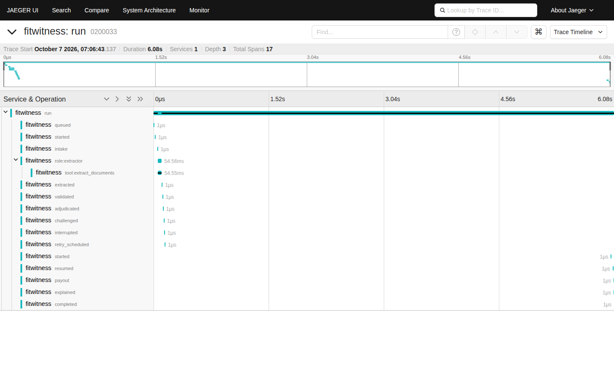

# 관측: 실행 기록에서 나오는 지표와 trace

실행마다 남는 이벤트 로그(`fw_events`)가 유일한 기록원입니다. 지표와 trace는 모두 이 로그에서 계산되므로, 계측 코드를 따로 두지 않고 실행이 죽은 뒤에도 같은 값을 다시 만들 수 있습니다.

| 무엇 | 어디서 | 비고 |
|---|---|---|
| Prometheus 지표 | `GET /metrics` | 실행 상태별 개수, 비용·토큰, 도구 호출, 이벤트 종류별 개수, 모델·도구 지연 히스토그램. DB에서 계산하므로 worker가 여러 프로세스여도 합산됩니다 |
| 실행별 span tree | `GET /api/runs/{id}/trace` | 역할(planner/challenger/extractor)별로 묶은 트리 |
| OpenTelemetry (OTLP) | `GET /api/runs/{id}/trace?format=otlp`, worker의 자동 전송, `python -m fitwitness.runtime.otlp` | 아래 |

## OpenTelemetry로 내보내기

환경 변수 하나로 켭니다. 표준 변수 이름을 그대로 씁니다.

```bash
OTEL_EXPORTER_OTLP_ENDPOINT=http://localhost:4318         # <endpoint>/v1/traces 로 전송
OTEL_EXPORTER_OTLP_TRACES_ENDPOINT=https://host/v1/traces  # 전체 URL을 줄 때(위보다 우선)
OTEL_EXPORTER_OTLP_HEADERS=authorization=Bearer xxx        # 인증 헤더
FITWITNESS_ENV=production                                  # deployment.environment (기본 local)
```

설정이 없으면 아무 일도 일어나지 않고, 설정이 있어도 전송은 실패해도 되는 부가 작업입니다(백엔드가 꺼져 있으면 짧은 제한 시간 뒤 로그 한 줄). 로컬에서 보려면 `docker compose -f deploy/observability/docker-compose.yml up -d` 후 `http://localhost:16686`에서 서비스 `fitwitness`를 고릅니다. Tempo나 OpenTelemetry Collector, 상용 백엔드도 같은 방식입니다.

- **한 실행은 한 번 전송됩니다.** 완료·실패·취소·무효화로 끝났을 때만 보냅니다. 담당자 응답을 기다리는 중이거나 재시도 대기 중인 실행은 아직 보내지 않습니다. OTLP에는 "이 span을 갱신"이 없고, 같은 span ID를 두 번 받은 백엔드는 둘 다 보관합니다(Jaeger 메모리 저장소에서 재개된 청구가 루트 2개로 보인 것을 확인하고 이렇게 바꿨습니다). 끝난 뒤의 trace는 대기한 시간까지 포함한 전체를 담습니다.
- **강제 종료된 실행도 보입니다.** 지급 기록 직후 worker가 죽는 체험(`중단 체험`)은 `interrupted → retry_scheduled → (백오프 5초) → started → resumed → payout → completed`가 한 trace에 이어집니다. 아래 화면이 그 예입니다.
- **ID는 결정적입니다.** trace ID는 실행 ID, span ID는 실행 ID와 이벤트 순번에서 만듭니다. 운영자가 `python -m fitwitness.runtime.otlp --tenant T --run R`로 같은 실행을 다시 보내도 같은 span이 됩니다. 아직 끝나지 않은 실행을 보려면 `--include-open`을 붙입니다.
- **span 속성**은 스칼라만 담습니다(`fw.latency_ms`, `fw.items`, `fw.role` 등). 중첩된 payload는 이벤트 로그에만 있습니다. 루트 span에는 실행 종류(drawing/claim)와 상태, 모델·도구 시간 합계가 붙습니다.



## 확인한 것과 하지 않은 것

- OTLP 요청이 공식 protobuf 정의(`opentelemetry-proto`)로 파싱되는지 단위 테스트가 확인합니다. 이 테스트 덕분에 ID 표기를 바로잡았습니다: OTLP/JSON은 trace·span ID를 base64가 아니라 16진수 문자열로 보냅니다.
- 실제 백엔드로는 **Jaeger 1.76.0 all-in-one 바이너리**를 로컬에서 띄워 청구·도면 실행과 중단 후 복구 실행을 보내고 trace 조회 API로 되읽었습니다. span 수·부모-자식 관계·상태가 맞았고 Jaeger의 경고(음수 지속 시간, 부모 범위 밖의 자식)는 0건이 되도록 고쳤습니다.
- `deploy/observability/docker-compose.yml`은 위와 같은 버전의 Jaeger 이미지를 쓰지만, 이 개발 환경에는 Docker 데몬이 없어 compose 파일 자체는 실행해 보지 못했습니다.
- 공개 데모(Render)는 OTLP 백엔드가 없어 전송을 켜지 않았습니다. Langfuse 같은 LLM 전용 관측 도구는 붙이지 않았습니다. 공개 데모가 규칙 엔진이라 모델 호출 trace가 비어 있고, 모델 호출은 운영자 실행에서만 생기기 때문입니다.
- 알림과 장기 SLO 기록은 여전히 없습니다.
